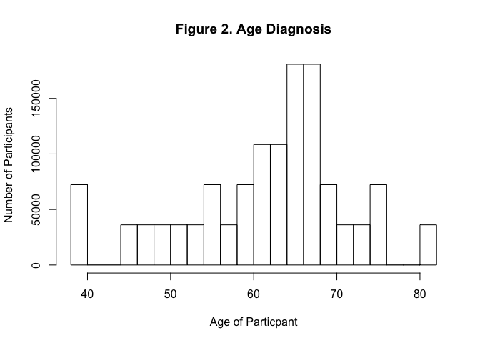
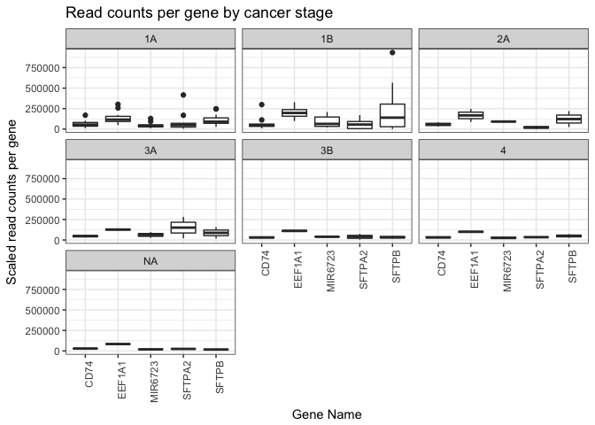

Analysis Report 2: Your Title Here
================
Don Francisco
November 10, 2017

*Overall, a single-spaced page is about 500 words. So if the guidelines say half of a page, think about writing around 250 words. You can use the wordcountaddin in RStudio to track your progress.*

Introduction
============

Add about 1 page here. Must cite at least 5 peer reviewed articles.

Methods
=======

Sample origin and sequencing
----------------------------

Add about half a page here. In this section instead of first person (I/we), use Li et al. (Li *et al.*, 2015) and Seo et al. (Seo *et al.*, 2012), since you'll just be describing what they did, based on the methods in their paper(s). It's important to include this so the reader knows what the study design was for the data you will be presenting.

Computational
-------------

These are the methods that were used to process the sequencing data. Should probably be at least a half of a page. At a very minimum should include citations for biomartr, trimmomatic, and sailfish. Note that these three methods references don't count towards the five references you need to cite in the introduction.

Results
=======

In addition to a minimum of 4-5 figures/tables (and associated captions), you should include sufficient text in this section to describe what your findings were. Remember that in the results section you just describe what you found, but you don't interpret it - that happens in the discussion.

Histogram of Age

``` r
female_data <- subset(final_table, gender == "female")

hist(female_data$age_at_diagnosis,
     main = "Figure 2. Age Diagnosis",
     xlab = "Age of Particpant",
     ylab = "Number of Participants")
```



| genename |  mean\_count|
|:---------|------------:|
| EEF1A1   |    149021.94|
| SFTPB    |    135305.42|
| SFTPA2   |     66520.77|
| CD74     |     58994.05|
| MIR6723  |     58916.57|
| RNA28S5  |     58079.55|
| FTL      |     51200.27|
| SFTPA1   |     50997.97|
| TPT1     |     40372.54|
| FN1      |     37823.53|
| RNA18S5  |     37644.20|
| FTH1     |     37047.05|
| SFTPC    |     35673.21|
| HLA      |     33688.34|
| NEAT1    |     31635.98|

**Table 1**: The most highly expressed genes in both genders included *SFTPB* and *EEF1A1*.


**Figure 1**: Here we show an example figure caption.



**Figure 2**: Here we show another example figure caption.

Discussion
==========

Add around 1-2 pages interpreting your results and considering future directions one might take in analyzing these data.

Sources Cited
=============

Li,Y. *et al.* (2015) RNA-seq analysis of lung adenocarcinomas reveals different gene expression profiles between smoking and nonsmoking patients. *Tumor Biology*, **36**, 8993–9003.

Seo,J.-S. *et al.* (2012) The transcriptional landscape and mutational profile of lung adenocarcinoma. *Genome research*, **22**, 2109–2119.
