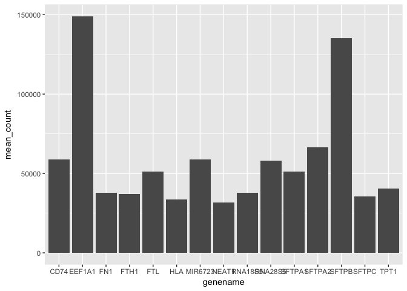
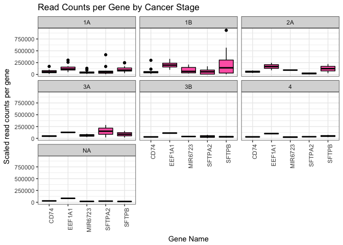
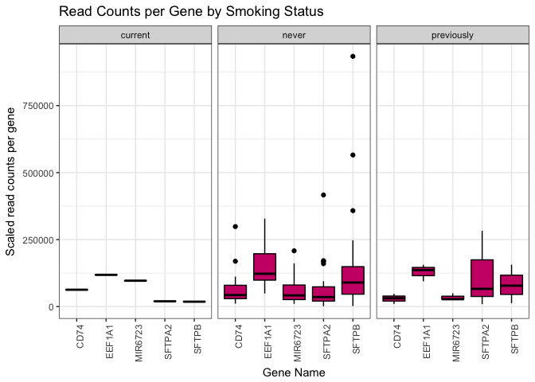

Analysis Report 2: Understanding Genetic Expression within Female Lung Cancer Patients
================
Katelyn Kukar
November 15, 2017

Introduction
============

Genes encode the proteins which dictate cellular functions within organisms. Each step in the flow of information from DNA to RNA to protein provides the cell with integral information that works to regulate functionality by adjusting the amount and type of proteins manufactured. The functionality of genes has been found to be unique among individual samples, with one study stating gene expression levels were variable based on the “underlying genetics of the \[samples\] they were collected from” (Abeyta *et al.*, 2004). Gene expression also gives essential information regarding cellular responses during diseased states and the communication of these genes to the cells to increase organismal immunity. Immune responses are heightened by a combination of genes when the cell is under distress, and understanding the unique integration of genes in molecular pathways can thoroughly improve the efficacy of combination treatments (Feld *et al.*, 2007). By profiling the expression of genes based on these genetically inherited differences, disease treatments can be crafted on an individual, patient basis.

Studies behind benign and malignant tumor formation are of increased interest for gene therapy studies, since they offer a control mechanism for the up and down regulation of essential genes under normal or uncontrolled cellular growth conditions. “Clients with very advanced cancers refractory to conventional treatment indicate that \[gene therapy\] can specifically mediate tumor regression with low toxicity” (Roth and Cristiano, 1997). Therefore, understanding how the organism responds to the inheritance of a single functionally defective gene through the regulation of defense genes is imperative to stopping tumor growth in patients prior to the removal of the defective gene through vector therapy (Roth and Cristiano, 1997).

Lung cancer has traditionally been associated with smoke inhalation from carcinogenic substances which activate a downstream pathway to accelerate the development of cancer (Gazdar *et al.*, 2004). Lung cancer is specifically caused by epidermal growth factor receptor genes, a receptor tyrosine kinase that can be modulated through inhibition with EGFR synthetic inhibition therapy (getfitnib) (Paez *et al.*, 2004). However, these methods are not conducive to long term treatments, due to the sensitivity predictions and high mutation rates of cancerous cells (Paez *et al.*, 2004). Within this study, we evaluate the representative genes discovered within smoking and non-smoking female patients, with cancerous tumors, and their associations with the human body, specifically EGFR. We predict that...HYPOTHESIS

Methods
=======

Sample origin and sequencing
----------------------------

Seo et al. (Seo *et al.*, 2012) collected 200 fresh surgical specimen (preserved with LN2) of primary lung adenocarcinoma from patients who underwent major lung resection. 87 of these cancer tissues with driver tissues that were not detected by screening tests, through Sanger sequencing for *EGFR* and *KRAS* mutation and fluorescence in situ hybridization \[FISH\] for *EML4-ALK* fusion, were analyzed by trascriptome sequencing for the paired tissue samples. For RNA-seq the RNAiso Plus kit from Takara was used, followed by RNeasy MinElute from Qiagen to purify the samples. RNA quality was assessed using RNA 6000 NanoLabchip on a 2100 Bioanalyzer from Agligent, with all samples matched to exome sequencing from normal lung genomic DNA. Samples were sequencing with Illumina TruSeq SBS Kit v3 on a HiSeq 2000 sequencer at Illumina Incorporated. Seo et al generated "14,038,673,860 paired-end 101-bp-long reads from RNA sequencing of 164 samples (87 cancer and 77 corresponding normal tissues). On average, the RNA sequencing throughputs were 9.77 and 7.38 Gbp for cancer and normal tissues, respectively. In the whole-exome sequencing of normal tissues, we obtained 32.96-fold read depth per tissue for regions targeted by the exome capture platform used in this study" (Seo *et al.*, 2012). Seo et al.aligned their RNA and exome sequencing reads through NCBI human reference genome using GSNAP, and also aligned RNA sequence reads to a cDNA set obtained from public databases.

Later, Li et al. (Li *et al.*, 2015) utilized RNA sequencing data from 68 lung adenocarcinoma patients with validated smoking status from Gene Expression Omnibus (GEO), collected originally from Seo et al. (2012). An out group was also collected for non-smoking patients from a separate GEO accession number.

Computational
-------------

We used the metadata originally retrieved from Seo et al. and re-purposed by Li et al. to create a relative study on the genes found within cancerous tissues from never, previously, and currently smoking patients.

**The compiled and joined data set was crafted on a server from the original sequenced SRA table. The data was formatted so have column sperated values that create unique names for each vector of interest.**

**These are the methods that were used to process the sequencing data. Should probably be at least a half of a page. At a very minimum should include citations for biomartr, trimmomatic, and sailfish. Note that these three methods references don't count towards the five references you need to cite in the introductio**

The code tolower was used to make each column name lower case before sub-setting the data to include only female participants. Using dplyr a primary table was crafted to show the number of patients within each cancer stage and their smoking status. Next, the data was subsetted again to look only at the top 5 genes of interest with the highest mean counts. Dplyr was used again to filter the data to look at the mean count of the 5 top genes as a table. These genes were summarized in a bar plot for reference. Once summarized the genes of interest were coded to become a vector to be used in accordance with smoking status and cancer stage. Boxplots were made utilizing this vector through a ggplot and dplyr syntax. **Lastly, dplyr was used again with the function mutate to visualize the up and down-regulation of the most interesting genes in comparisson to the paired normal tissues sewqenced as a baseline.**

Results
=======

Once the metadata was organized as a column seperated value spreadsheet, with associated vectors, it could be loaded in for direct analysis. We apply multiple R source libraries to graphically represent all RNA sequence data to analysize. We utilize R to count and quanitfy many of the gene levels based on known phenotypic traits, in order to, evaluate each gene type found in reference to one another within the female population tested.

Tabular Results
---------------

Since female participants are primarily of interest the data was filtered to highlight this gender only. The tables represent quantified results from the female pariticipant cancer tissue samples.

| Cancer Stage |  Current Smoker|  Never Smoker|  Previous Smoker|
|:-------------|---------------:|-------------:|----------------:|
| 1A           |               0|            15|                1|
| 1B           |               0|             9|                1|
| 2A           |               0|             2|                0|
| 3A           |               1|             0|                1|
| 3B           |               0|             2|                0|
| 4            |               0|             2|                0|

**Table 1**: Females that never smoke seem to be more likely to have cancer at any stage.

| genename |  mean\_count|
|:---------|------------:|
| EEF1A1   |    149021.94|
| SFTPB    |    135305.42|
| SFTPA2   |     66520.77|
| CD74     |     58994.05|
| MIR6723  |     58916.57|

Visualization of tabular data is shows quanitfication of gene counts in reference to one another for the 5 most common genes from all female samples.

Graphical Results
-----------------

**Table 2**: The most highly expressed genes for females includes *SFTPB* and *EEF1A1*.

**Figure 1**: Here we visualize the mean counts of the top five most prevalent genes revealed within the entire sample pool.

From Figure 1 results we visualize *EEF1A1* to be the gene of most interest.

**Figure 2**: Here we visualize the gene counts for the top 5 most prevalent genes categorized by cancer stage.

From Figure 2, we can see *EEF1A1* has the highest count per gene in stages 1A, 2A, 3B, and 4. We see *SFTPB* is the highest in stage 1B, and *SFTPA2* is the highest in stage 3A. *SFTPB* has a boxplot that has a much larger spread in stage 1B than any other spreads seen throughout all stages.

**Figure 3**: Here we visualize the gene counts for the top 5 most prevalent genes categorized by smoking status.

From Figure 3, we can see *EEF1A1* has the largest statistical spread in patients that have never smoked, while we see *SFTPA2* has the largest spread in previously smoking patients. *SFTPB* has a noticeable spread in both never and previously smoking patients, but more outliers are seen in never smoking patients. Currently smoking patients have expression in *EEF1A1* and *MIR6723*.

Discussion
==========

Look in OMIM under NCBI

Add around 1-2 pages interpreting your results and considering future directions one might take in analyzing these data.

Sources Cited
=============

Abeyta,M.J. *et al.* (2004) Unique gene expression signatures of independently-derived human embryonic stem cell lines. *Human molecular genetics*, **13**, 601–608.

Feld,J.J. *et al.* (2007) Hepatic gene expression during treatment with peginterferon and ribavirin: Identifying molecular pathways for treatment response. *Hepatology*, **46**, 1548–1563.

Gazdar,A.F. *et al.* (2004) Mutations and addiction to egfr: The achilles ‘heal’of lung cancers? *Trends in molecular medicine*, **10**, 481–486.

Li,Y. *et al.* (2015) RNA-seq analysis of lung adenocarcinomas reveals different gene expression profiles between smoking and nonsmoking patients. *Tumor Biology*, **36**, 8993–9003.

Paez,J.G. *et al.* (2004) EGFR mutations in lung cancer: Correlation with clinical response to gefitinib therapy. *Science*, **304**, 1497–1500.

Roth,J.A. and Cristiano,R.J. (1997) Gene therapy for cancer: What have we done and where are we going? *Journal of the National Cancer Institute*, **89**, 21–39.

Seo,J.-S. *et al.* (2012) The transcriptional landscape and mutational profile of lung adenocarcinoma. *Genome research*, **22**, 2109–2119.
