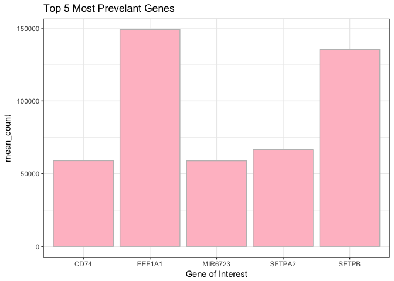

Analysis Report 2: Understanding Genetic Expression within Female Lung Cancer Patients
================
Katelyn Kukar
November 15, 2017

Introduction
============

Genes encode the proteins which dictate cellular functions within organisms. Each step in the flow of information from DNA to RNA to protein provides the cell with integral information that works to regulate functionality by adjusting the amount and type of proteins manufactured. The functionality of genes has been found to be unique among individual samples, with one study stating gene expression levels were variable based on the “underlying genetics of the \[samples\] they were collected from” (1). Gene expression also gives essential information regarding cellular responses during diseased states and the communication of these genes to the cells to increase organismal immunity. Immune responses are heighted by a combination of genes when the cell is under distress, and understanding the unique integration of genes in molecular pathways can thoroughly improve the efficacy of combination treatments (2). By profiling the expression of genes based on these genetically inherited differences, disease treatments can be crafted on an individual, patient basis.

Studies behind benign and malignant tumor formation are of increased interest for gene therapy studies, since they offer a control mechanism for the up and down regulation of essential genes under normal or uncontrolled cellular growth conditions. “Clients with very advanced cancers refractory to conventional treatment indicate that \[gene therapy\] can specifically mediate tumor regression with low toxicity” (3). Therefore, understanding how the organism responds to the inheritance of a single functionally defective gene through the regulation of defense genes is imperative to stopping tumor growth in patients prior to the removal of the defective gene through vector therapy (3).

Lung cancer has traditionally been associated with smoke inhalation from carcinogenic substances which activate a downstream pathway to accelerate the development of cancer (5). Lung cancer is specifically caused by epidermal growth factor receptor genes, a receptor tyrosine kinase that can be modulated through inhibition with EGFR synthetic inhibition therapy (getfitnib) (4). However, these methods are not conducive to long term treatments, due to the sensitivity predictions and high mutation rates of cancerous cells (4). Within this study, we evaluate the representative genes discovered within smoking and non-smoking female patient tumors and their associations with the human body, specifically EGFR. We predict that...HYPOTHESIS

Methods
=======

Sample origin and sequencing
----------------------------

Add about half a page here. In this section instead of first person (I/we), use Li et al. (Li *et al.*, 2015) and Seo et al. (Seo *et al.*, 2012), since you'll just be describing what they did, based on the methods in their paper(s). It's important to include this so the reader knows what the study design was for the data you will be presenting.

Computational
-------------

These are the methods that were used to process the sequencing data. Should probably be at least a half of a page. At a very minimum should include citations for biomartr, trimmomatic, and sailfish. Note that these three methods references don't count towards the five references you need to cite in the introduction.

Results
=======

In addition to a minimum of 4-5 figures/tables (and associated captions), you should include sufficient text in this section to describe what your findings were. Remember that in the results section you just describe what you found, but you don't interpret it - that happens in the discussion.

``` r
female_data <- subset(final_table, gender == "female")

#make a table with the number of females at each stage in treatment, fill by smoking status (never previously current)

female_data %>%
  filter(genename == "A1CF") %>%
  with(table(cancer_stage, smoking_status)) %>%
  kable(rownames("Smoking Status"))
```

|     |  current|  never|  previously|
|-----|--------:|------:|-----------:|
| 1A  |        0|     15|           1|
| 1B  |        0|      9|           1|
| 2A  |        0|      2|           0|
| 3A  |        1|      0|           1|
| 3B  |        0|      2|           0|
| 4   |        0|      2|           0|

| genename |  mean\_count|
|:---------|------------:|
| EEF1A1   |    149021.94|
| SFTPB    |    135305.42|
| SFTPA2   |     66520.77|
| CD74     |     58994.05|
| MIR6723  |     58916.57|

**Table 1**: The most highly expressed genes for females includes *SFTPB* and *EEF1A1*.



**Figure 1**: Here we visualize the mean counts of the top five most prevelant genes revealed within the entire sample pool. We visualize *EEF1A1* to be the gene of most interest


**Figure 2**: Here we visualize the gene counts for the top 5 most prevelant genes categorized by cancer stage. We can see *EEF1A1* has the highest count per gene in stages 1A, 2A, 3B, and 4. We see *SFTPB* is the highest in stage 1B, and *SFTPA2* is the highest in stage 3A. *SFTPB* has a boxplot that has a much larger spread in stage 1B than any other spreads seen throughout all stages.

``` r
female_data %>%
  filter(genename %in% top_genes) %>%
  ggplot(aes(x = genename,
             y = counts_lengthscaledtpm)) +
    geom_boxplot() +
    facet_wrap(~smoking_status) +
    xlab("Gene Name") +
    ylab("Scaled read counts per gene") +
    ggtitle("Read counts per gene by smoking status") +
    theme_bw() + # simplifies theme
    theme(axis.text.x = # rotates x axis labels vertically
            element_text(angle = 90,
                         hjust = 1))
```


**Figure 3**: Here we visualize the gene counts for the top 5 most prevelant genes categorized by smoking status. We can see *EEF1A1* has the largest statistical spread in patients that have never smoked, while we see *SFTPA2* has the largest spread in previously smoking pateints. *SFTPB* has a noticible spread in both never and previously smoking patients, but more outliers are seen in never smoking patients. Currently smooking patients have expression in *EEF1A1* and *MIR6723*.

Discussion
==========

Look in OMIM under NCBI

Add around 1-2 pages interpreting your results and considering future directions one might take in analyzing these data.

Sources Cited
=============

Li,Y. *et al.* (2015) RNA-seq analysis of lung adenocarcinomas reveals different gene expression profiles between smoking and nonsmoking patients. *Tumor Biology*, **36**, 8993–9003.

Seo,J.-S. *et al.* (2012) The transcriptional landscape and mutational profile of lung adenocarcinoma. *Genome research*, **22**, 2109–2119.
